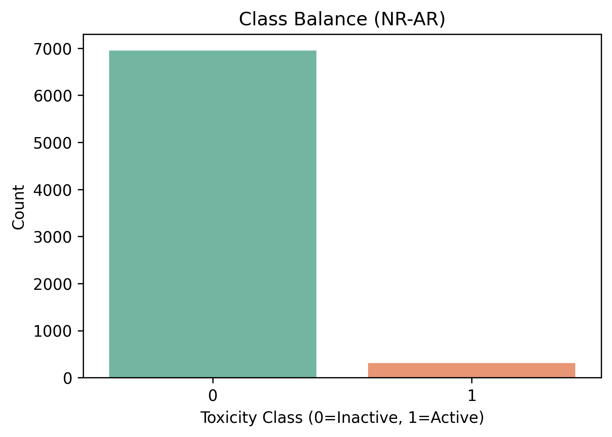
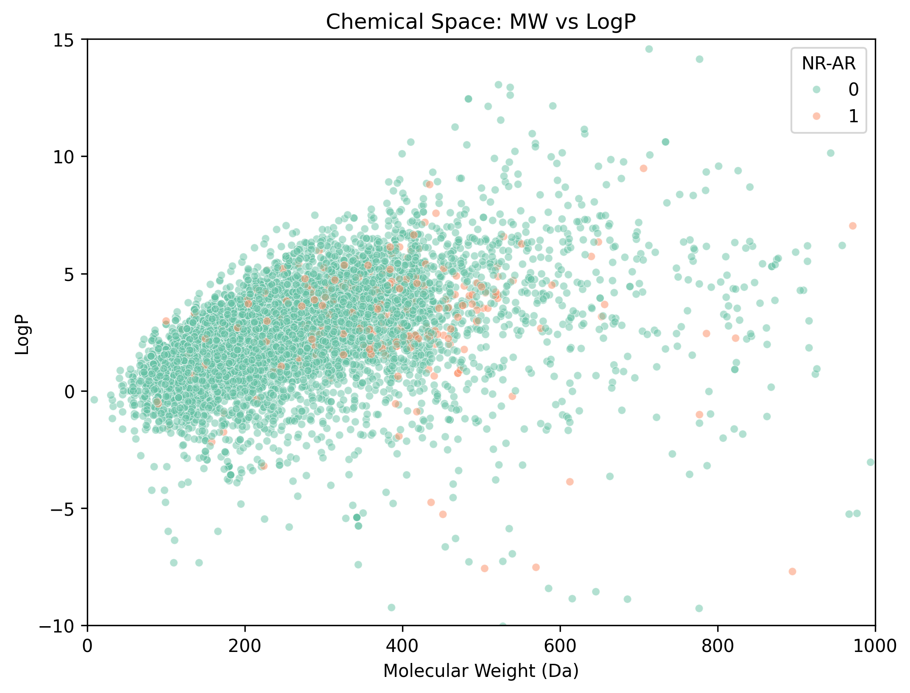
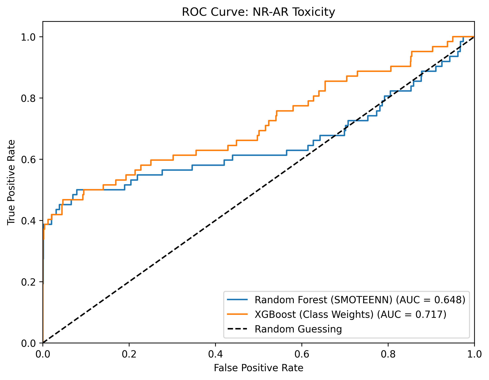

# Прогноз токсичности химических соединений (Tox21)

## Описание проекта
Данный проект направлен на предсказание биологической активности молекул по отношению к андрогеновому рецептору (мишень `NR-AR`). Проект выполнен в рамках курса «ИИ в биотехнологии» и представляет собой полный цикл применения машинного обучения в хемоинформатике.

Цель: классификация молекул на токсичные (активные) и нетоксичные (неактивные) на основе их химической структуры.

## Данные и проблема дисбаланса
Использован открытый датасет **Tox21** (Toxicology in the 21st Century), предоставленный в рамках бенчмарка MoleculeNet. Итоговый очищенный набор содержит 7,258 молекул.

Главная сложность датасета — **экстремальный дисбаланс классов** (~96% неактивных и ~4% активных соединений).

  

## Химическое пространство (EDA)
В ходе разведочного анализа данных (EDA) были вычислены базовые молекулярные дескрипторы. Анализ химического пространства показал, что токсичные молекулы (класс 1) имеют тенденцию группироваться в специфическом диапазоне молекулярной массы (MW) и липофильности (LogP).

  

## Структура репозитория
- `data/` — скачанные и обработанные данные (CSV).
- `src/` — исходный код проекта.
  - `step1_download_inspect.py` — загрузка данных из MoleculeNet.
  - `step2_clean_data.py` — валидация SMILES через RDKit и удаление дубликатов.
  - `step3_eda.py` — вычисление физико-химических дескрипторов и визуализация.
  - `step4_features.py` — генерация 2048-битных Morgan Fingerprints + 6 дескрипторов.
  - `step5_models.py` — применение SMOTEENN, обучение моделей и Threshold Tuning.
- `reports/figures/` — сохраненные графики EDA и ROC-кривые.

## Результаты и методы борьбы с дисбалансом
Для решения проблемы дисбаланса были применены следующие методы:
1. **Генерация дополнительных признаков**: к фингерпринтам добавлены 6 физико-химических дескрипторов (MW, LogP, TPSA, HBD, HBA, RotBonds).
2. **SMOTEENN** (Synthetic Minority Over-sampling Technique + Edited Nearest Neighbours) — для случайного леса.
3. **Threshold Tuning** — динамический подбор порога классификации (Threshold) для максимизации F1-Score.

**Итоговые метрики:**
- **XGBoost (Class Weights)**: ROC-AUC = 0.716, Оптимальный порог = 0.883
- **Random Forest (SMOTEENN)**: ROC-AUC = 0.648, Оптимальный порог = 0.759

Благодаря алгоритму поиска оптимального порога удалось достичь высокой точности классификации токсичных молекул: **Precision = 0.89** (ошибка составляет всего 11% при классификации молекулы как токсичной) при **F1-score = 0.54**, что является отличным показателем (High Confidence Screening) для специфики данных Tox21.

## Стек технологий
- Python 3
- RDKit (хемоинформатика)
- pandas, numpy (обработка данных)
- scikit-learn, xgboost, imbalanced-learn (машинное обучение)
- matplotlib, seaborn (визуализация)
