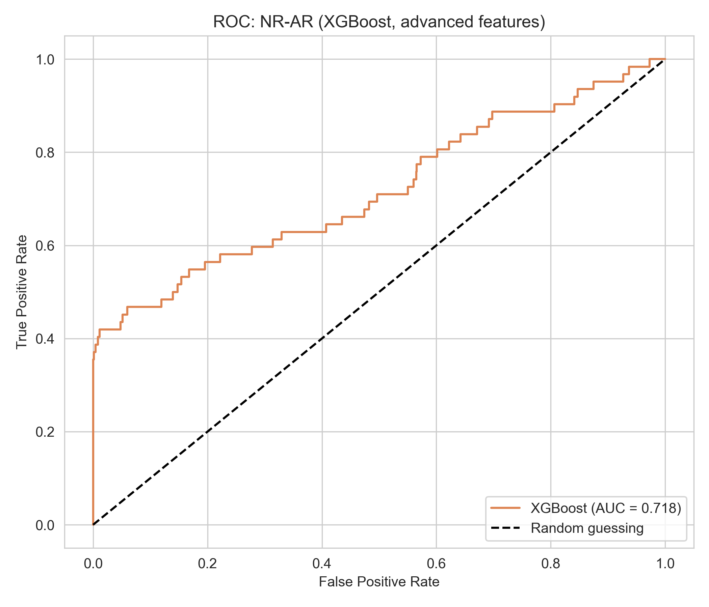
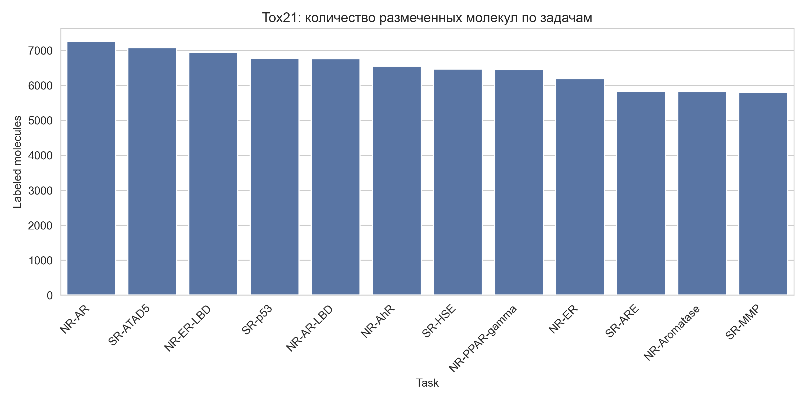
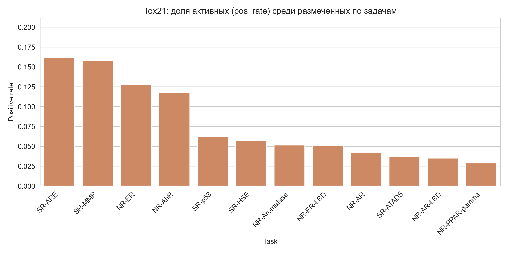
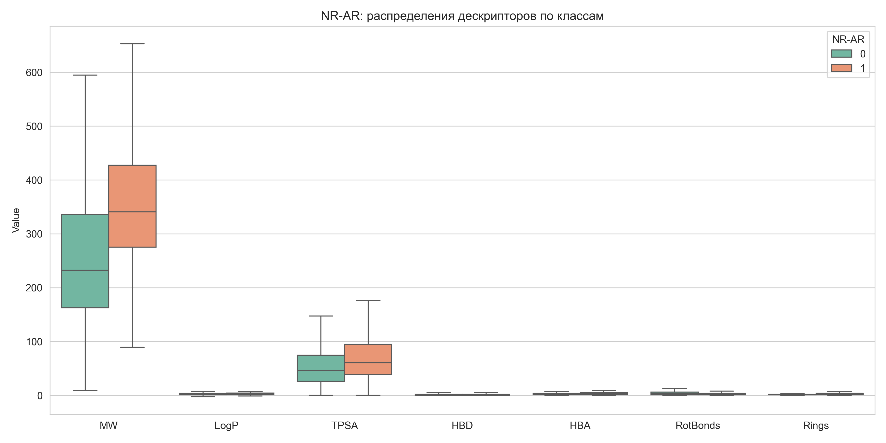
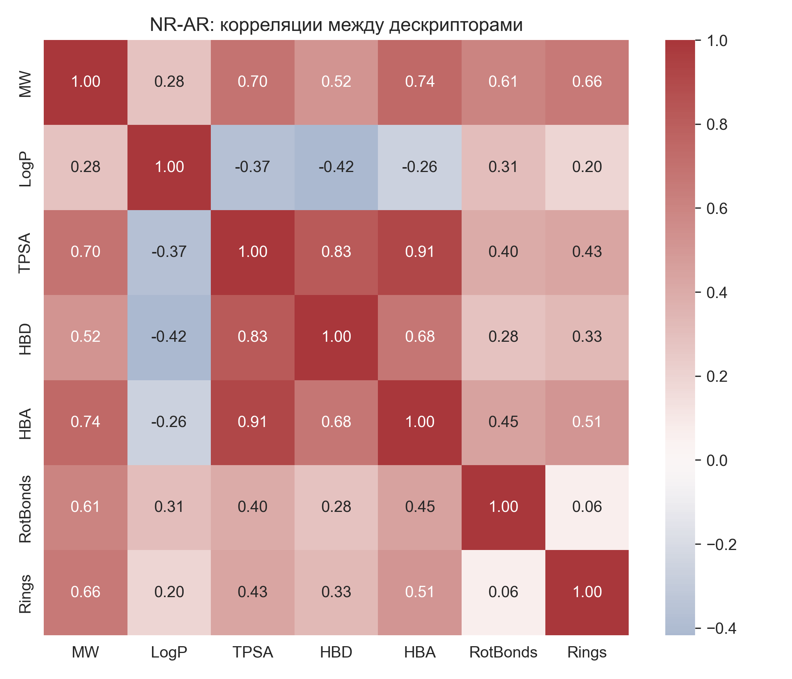
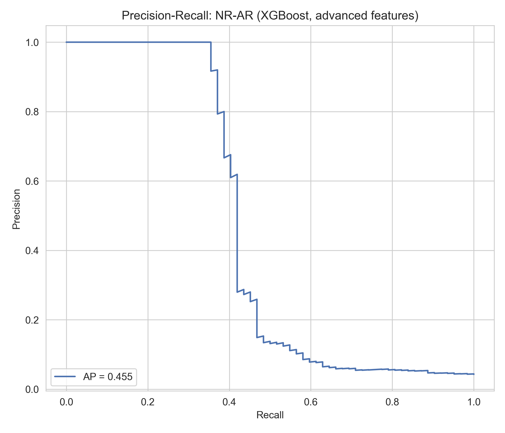
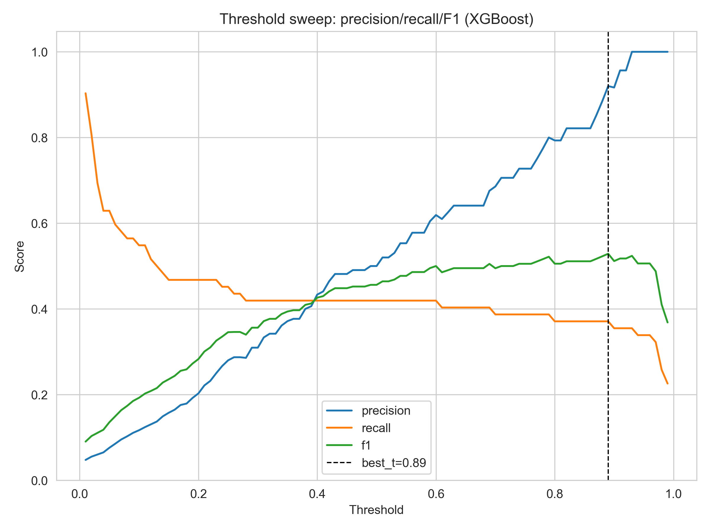
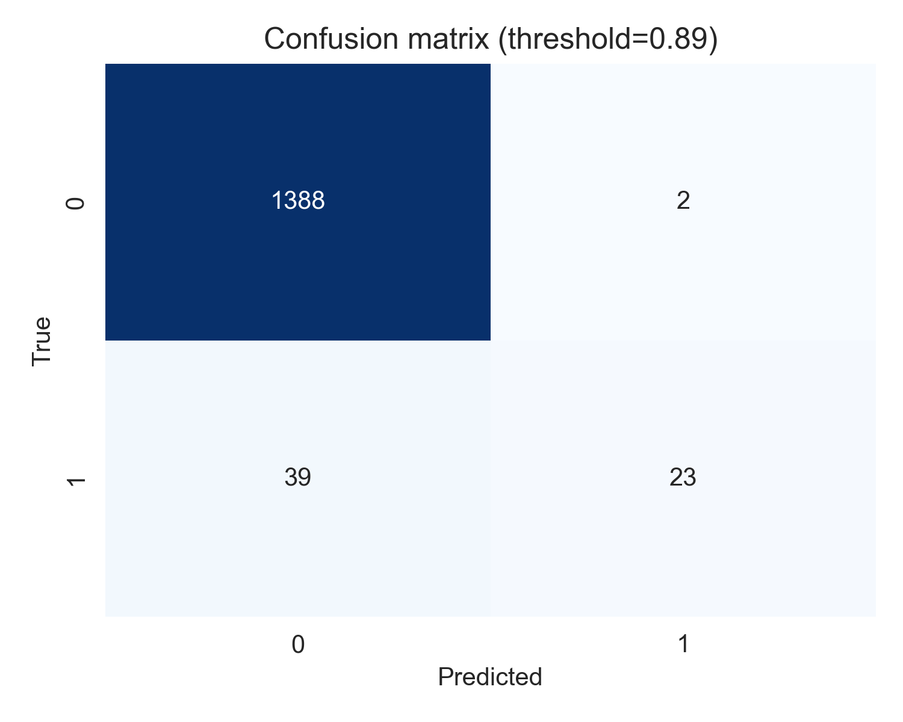

# Tox21 NR-AR: прогноз токсичности по структуре молекулы

Проект: бинарная классификация активности соединений против мишени **NR-AR** (андрогеновый рецептор) на базе датасета **Tox21**.

<p align="center">
  
</p>

## 1. Постановка задачи
Цель — построить воспроизводимый ML-пайплайн, который по строке **SMILES** предсказывает, является ли молекула **активной/токсичной** (класс 1) или **неактивной** (класс 0) в in vitro тесте NR-AR.

Ключевая сложность задачи — сильный дисбаланс классов и неполная разметка по задачам внутри Tox21.

## 2. Датасет (Tox21 / MoleculeNet)

### 2.1. Формат данных
Исходный файл содержит:
- `smiles` — строковое представление структуры молекулы
- `mol_id` — идентификатор
- 12 бинарных таргетов (NR-* и SR-*), по которым имеются пропуски (NaN)

### 2.2. Покрытие разметкой по задачам
Число размеченных молекул различается по задачам (таргетам), поэтому при выборе конкретной мишени меняется фактический размер обучающего набора.

<p align="center">
  
</p>

Доля активных (pos_rate) также различается по задачам — это означает, что степень дисбаланса не одинакова для разных таргетов.

<p align="center">
  
</p>

Для выбранной задачи **NR-AR** (см. `reports/tox21_dataset_summary.csv`):
- `n_total = 7831`
- `n_labeled = 7265`, `missing_rate ≈ 0.072`
- `pos = 309`, `neg = 6956`, `pos_rate ≈ 0.043`

## 3. Подготовка данных
1. Фильтрация по таргету NR-AR: удаление строк с NaN в `NR-AR`.
2. Валидация SMILES через RDKit и удаление невалидных структур.
3. (Опционально) Дедупликация по каноническому SMILES.

Итоговый очищенный набор: `data/tox21_nr_ar_cleaned.csv`.

## 4. EDA и интерпретируемые признаки
Были вычислены 2D-дескрипторы RDKit:
- `MW`, `LogP`, `TPSA`, `HBD`, `HBA`, `RotBonds`, `Rings`

Сдвиги распределений по классам показывают, что глобальные физико-химические свойства несут сигнал для классификации и дополняют структурные фингерпринты.

<p align="center">
  
</p>

Корреляции между дескрипторами помогают понимать избыточность (например, сильная связь TPSA с HBA/HBD).

<p align="center">
  
</p>

Артефакт с дескрипторами сохранён в `reports/nr_ar_descriptors.csv`.

## 5. Feature Engineering
Финальная матрица признаков включает:
- **Morgan fingerprints** (радиус 2, 2048 бит)
- 6 численных дескрипторов (`MW`, `LogP`, `TPSA`, `HBD`, `HBA`, `RotBonds`)

Итоговый файл: `data/tox21_nr_ar_features_adv.csv`.

## 6. Модели и оценка качества

### 6.1. Почему не Accuracy
Из-за дисбаланса классов (редкий класс 1) Accuracy плохо отражает качество модели. Основная метрика:
- **ROC-AUC**
Дополнительно:
- Precision / Recall / F1 для класса 1

### 6.2. Модель
Использована модель **XGBoost** с учётом дисбаланса через `scale_pos_weight` и масштабирование численных признаков.

### 6.3. ROC и PR кривые
ROC-AUC для XGBoost с расширенными признаками около **0.718**.

<p align="center">
  
</p>

При сильном дисбалансе информативна также Precision–Recall кривая (AP около **0.455**).

<p align="center">
  
</p>

## 7. Threshold tuning (подбор порога)
По умолчанию класс 1 выбирается при threshold=0.5. Здесь порог подбирался перебором, выбирая значение, максимизирующее **F1**.

<p align="center">
  
</p>

Табличный артефакт: `reports/threshold_sweep_xgb_adv.csv`.

## 8. Матрица ошибок (интерпретация)
При пороге около **0.89** получаем режим high-confidence screening: очень мало ложных срабатываний (FP), но часть токсичных молекул пропускается (FN).

<p align="center">
  
</p>

## 9. Структура репозитория
- `src/`
  - `step1_download_inspect.py` — загрузка и первичный осмотр
  - `step2_clean_data.py` — валидация SMILES (RDKit)
  - `step3_eda.py` — базовый EDA
  - `step4_features.py` — генерация fingerprints + дескрипторов
  - `step5_models.py` — обучение и метрики
  - `step6_visualizations.py` — расширенная визуализация + отчёты
- `data/` — данные (локально)
- `reports/` — таблицы отчётов и визуализации

## 10. Как воспроизвести
Примерный порядок:
```bash
python src/step1_download_inspect.py
python src/step2_clean_data.py
python src/step4_features.py
python src/step5_models.py
python src/step6_visualizations.py
